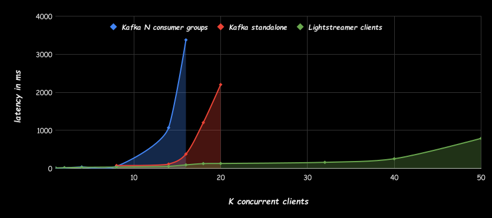
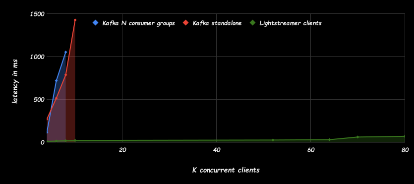
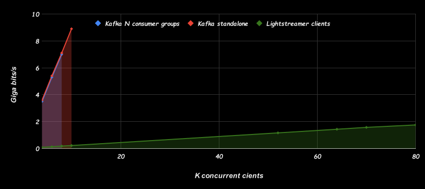
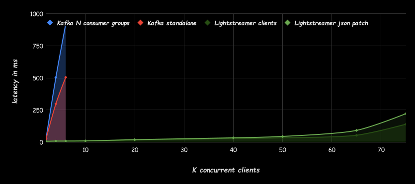
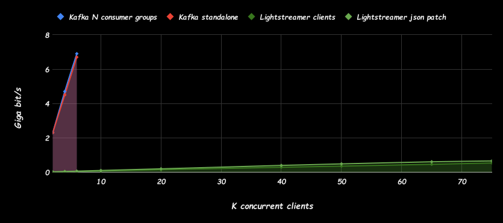

# Kafka Load and Stress Testing Tool

## TL;DR
>_Even under the same conditions without special optimizations, Lightstreamer Kafka Connector can scale to tens of thousands of clients, far surpassing the scalability of clients connecting directly to the Kafka broker. These scalability results were achieved using a relatively modest-size server instance._
>
>

- [Introduction](#introduction)
  - [Pure Kafka clients case](#pure-kafka-clients-case)
  - [Lightstreamer Kafka Connector case](#lightstreamer-kafka-connector-case)
- [Features and purpose of tests](#features-and-purpose-of-tests)
- [Scenarios](#scenarios)
- [Test methodology](#test-methodology)
  - [Setup the environment](#setup-the-environment)
  - [Scenario 1](#scenario-1)
  - [Scenario 2](#scenario-2)
  - [Scenario 3](#scenario-3)
    - [JSON patch](#json-patch)
- [Measurements](#measurements)
- [Results](#results)
  - [Scenario 1](#scenario-1-1)
  - [Scenario 2](#scenario-2-1)
  - [Scenario 3](#scenario-3-1)
- [Conclusions](#conclusions)
- [Useful links](#useful-links)
- [Contributing](#contributing) 

## Introduction
This project provides a suite of programs designed to benchmark the performance of __pure Kafka brokers__ vs. __Lightstreamer Kafka Connector__ in handling high-volume data streams across thousands or more clients.

__The tests employs a single topic with a single partition. This choice aligns with the nature of the simulations we will conduct, where all clients are expected to consume all messages produced for the topic or a subset that is solely governed by the application logic of individual clients.__

Typical examples of this type of message flow include scenarios where Kafka data should be broadcast to web and mobile applications:
* __Financial applications__: Transmitting stock prices to trading applications. A Kafka topic carries all market updates, and clients may want to receive messages related to a single stock, a group of stocks, or a market index.
* __Telemetry applications__: A Kafka topic carries real-time telemetry data collected from producers. A client dashboard is built to display specific metrics.
* __Chat applications__: A Kafka topic carries all chat messages, which should be delivered to specific client applications based on the chat room they are displaying.

In some scenarios, it is expected that only a subset of messages will reach each client. However, this selection is entirely governed by the application logic and is fundamentally different from how Kafka distributes messages among consumers within a consumer group. For instance, this selection could be based on a specific value of the message key or a particular field within the message itself. Such a scenario would be challenging to adapt to the distribution of various consumer groups across multiple partitions or by proliferating a multitude of topics.

Additionally, the decision to use a single topic and a single partition is motivated by the desire to maintain simplicity. This approach simplifies the overall architecture and facilitates easier implementation and management. By avoiding unnecessary complexity, we can focus on the core aspects of performance evaluation and gain clearer insights into the comparative analysis without compromising the generality and validity of the measurements.

The main purpose of these tests is to conduct a comparison between two different architectures:

### Pure Kafka clients case
In this scenario, one or more producers send messages to a single Kafka topic, and all test clients connect directly to the Kafka broker to consume all messages associated with that topic. To achieve this, we tested two options: consumer groups with a single consumer each and standalone clients. Both options ensure that all clients receive all messages from the topic.
        
 

### Lightstreamer Kafka Connector case
In contrast, this approach uses the Lightstreamer Kafka Connector as the sole client for the Kafka broker. Like the previous case, it consumes all messages produced for the single topic defined in the simulation and distributes them to the multitude of clients requiring message consumption.

 

[Lightstreamer Kafka Connector](https://github.com/Lightstreamer/Lightstreamer-kafka-connector) is a tool that bridges Apache Kafka with Lightstreamer's real-time web streaming capabilities. __It enables efficient and scalable real-time data distribution from Kafka topics to remote mobile and web apps via the Lightstreamer broker.__

The Lightstreamer broker, which is the core of the Lightstreamer Kafka Connector, optimizes data delivery to clients with __intelligent streaming__. Using WebSockets and HTTP streaming, Lightstreamer dynamically throttles the data flow, applying data resampling and conflation to adapt to the network capacity of each client, and efficiently passing through proxies, firewalls, and other network intermediaries. Lightstreamer minimizes bandwidth usage while ensuring timely delivery of relevant updates to connected clients. This approach allows Lightstreamer to scale seamlessly to support large numbers of concurrently connected clients, making it ideal for high-throughput, internet-facing, real-time applications.

## Features and purpose of tests
The benchmarking tool contained in this project is intended to assist developers and system administrators in evaluating the scalability of Kafka topic broadcasting, with and without Lightstreamer Kafka Connector. By simulating a large number of client connections and measuring various performance metrics, users can gain insights into the scalability, throughput, and latency characteristics of each platform.

The tool includes components for generating load with random data streams, simulating client connections, and measuring key performance indicators such as message delivery latency, throughput, and system resource utilization.

To recap:
* __Scalability Testing__: Simulate thousands of concurrent client connections to assess the scalability of the platform.
* __Latency Measurement__: Measure end-to-end message delivery latency under varying load conditions.
* __Throughput Analysis__: Evaluate the maximum throughput achievable by each platform under different scenarios.
* __Resource Monitoring__: Monitor system resource utilization (CPU, memory, network) during benchmarking tests.

## Scenarios

Leveraging the software tools from this project, we conducted a series of tests with various configurations to simulate different scenarios.

The first scenario involved generating simple messages with a single field containing a randomly generated __alphanumeric string of 1024 bytes__. Each message was accompanied by a basic header containing the creation timestamp and the producer's ID. These messages were sent to a Kafka topic without specifying a key, resulting in all clients receiving all messages. Furthermore, there was no possibility of performing delta delivery on the message payload. For this scenario, we set a message production and sending frequency of __4 messages per second__.

The second scenario replicated the message composition of the first but __added a key value__ chosen from a set of 40 possibilities to each message sent to Kafka. This allowed Lightstreamer clients to take advantage of the publish-subscribe functionality and subscribe to a specific item associated with a single key, receiving only the messages relevant to that key. In contrast, a generic Kafka client would receive all messages and have to determine which messages to process based on the key. The advantages in terms of network bandwidth savings are evident. For this scenario, we set a message production and sending frequency of __100 messages per second__.

In the third scenario, we __serialized JSON messages in Kafka__. The message producer sent a sequence of messages with variations in only a subset of the fields composing the JSON structure for each key. Lightstreamer Kafka Connector allows you to specify that messages read from a particular topic should be deserialized into JSON objects and map the JSON structure to different Lightstreamer fields. This enables not only key filtering optimization but also the exploitation of the delta delivery mechanism offered by the Lightstreamer engine. This mechanism determines which fields have changed in each message and sends only the differences, resulting in additional savings in network resource usage. For this scenario, we set a message production and sending frequency of __100 messages per second__.

In this particular case, the test load is generated through messages composed of a complex JSON structure with various fields:
```JSON
{
  "id": "random_person_name",
  "firstText": "random_alphanumeric_string(256)",
  "secondText": "random_alphanumeric_string(256)",
  "thirdText": "random_alphanumeric_string(256)",
  "fourthText": "random_alphanumeric_string(256)",
  "firstNumber": "random_integer",
  "secondNumber": "random_integer",
  "thirdNumber": "random_integer",
  "fourthNumber": "random_integer",
  "hobbies": ["random_hobby", "random_hobby", "random_hobby"],
  "timestamp": "current_timestamp"
}
```

With each update related to a specific key, the values change only for these fields:
 - `timestamp`: Always changes to the exact time the new message is generated.
 - One random field among `firstText`, `secondText`,`thirdText`, `fourthText`: These are 256-character alphanumeric strings generated randomly.
 - One random field among `firstnumber`, `secondNumber`, `thirdNumber`, `fourthNumber`: These are random integer values.
 - `id`: This field corresponds to the key used to send the message to Kafka and is a randomly generated person name. It never changes.
 - `hobbies`: This field is an array of string valued with 3 names of hobbies randomly selected from a list. It never changes.

Here, a variation of the third scenario exists.
In this variation, the JSON object is not mapped to individual fields within the Lightstreamer item by Lightstreamer Kafka Connector. Instead, it's mapped as a string value into a single field.
Unfortunately, Lightstreamer's delta delivery mechanism, which transmits only changed fields, cannot be used in this situation.
However, similar optimization benefits can be achieved by leveraging on the field one of the available diff algorithms like `JSON Patch`. __The JSON Patch algorithm  allows for efficient data transmission__ by sending only the changes (patches) made to a JSON document instead of the entire document. This significantly reduces bandwidth usage when updating JSON messages.
This approach is particularly useful for very complex structures that are difficult to map statically or when the client application needs the entire JSON object for specific reasons.

These scenarios demonstrate how key-based filtering and selective field transmission can enhance the scalability, efficiency, and responsiveness of data distribution in real-time streaming applications.

## Test methodology

### Setup the environment
The tests were conducted in an AWS environment using EC2 instances. Specifically, the following instances were dedicated:

* __t2.small instance__ This instance served two purposes: simulating the various scenarios with the message producer and consuming messages with the 'latency report' function enabled in order to calculate statistics. Since both the producer (generating timestamps) and the latency-calculating client reside on the same machine, clock synchronization issues were avoided.
* __c7i.xlarge instance__ This instance was dedicated to the Kafka broker.
* __c7i.xlarge instance__ This instance was dedicated to Lightstreamer Kafka Connector.
* __Multiple c7i.2xlarge instances__ These instances simulated clients. For the pure Kafka case, we used the project's built-in consumers. For the Lightstreamer Connector case, we used a modified version of the [Lightstreamer Load Test Toolkit](https://github.com/Lightstreamer/load-test-toolkit/tree/lightstreamer-kafka-connector-benchmark).

As the __Kakfa broker__ we used the official Apache distribution version 3.5.1. For the installation simply follow the basic instructions from this tutorial: [https://kafka.apache.org/quickstart](https://kafka.apache.org/quickstart)

The __Lightstreamer server__ version used was __7.4.2__, and __Lightstreamer Kafka Connector__ version was __0.1.0__. To install these for the tests, start with the brief guide 'GETTING_STARTED.TXT' found in the default distribution of the [Lightstreamer server](https://lightstreamer.com/download/). Next, install the LoadTestToolkit adapter as explained [here](https://github.com/Lightstreamer/load-test-toolkit/tree/lightstreamer-kafka-connector-benchmark?tab=readme-ov-file). Finally, install Lightstreamer Kafka Connector. Begin with the installation notes found [here](https://github.com/Lightstreamer/Lightstreamer-kafka-connector/releases), which includes instructions within the zip file. The `resources/ConnectorConfigurations` folder contains the configurations (the `adapters.xml` file) used for Lightstreamer Kafka Connector in various scenarios. In all configurations the parameter

```sh
    <!-- The Kafka cluster address -->
    <param name="bootstrap.servers">localhost:9092</param>
```

contains localhost but should be changed with the actual Kafka cluster address.

The JVM used in all tests was `OpenJDK Runtime Environment Corretto-21.0.2.13.1 (build 21.0.2+13-LTS)`.

For all scenarios in the pure Kafka client case, we tested with two configurations:

1. **Clients in different consumer groups**: Each client specifies a unique consumer group, ensuring that all clients receive all messages from the topic.
2. **Standalone clients**: Each standalone client processes all messages independently, requiring manual offset management and not benefiting from load distribution.

All tests were conducted without using TLS communication between clients and servers. This was done to simplify the test scenarios, considering that in real production environments, TLS is often handled by external offloaders.

### Scenario 1
In the simplest scenario, the relevant configuration for Lightstreamer Kafka Connector is reduced to defining the topic to read messages from and mapping the corresponding item and message text to a single Lightstreamer field:
```xml
        <!-- TOPIC MAPPING SECTION -->
        <!-- Define a "ltest" item-template, which is simply made of the "ltest" item name to be used by the Lighstreamer Client subscription. -->
        <param name="item-template.ltest">ltest</param>

        <!-- Map the topic "LTest" to the previous defined "ltest" item template. -->
        <param name="map.LTest.to">item-template.ltest</param>

        <!-- FIELDS MAPPING SECTION -->

        <!-- Extraction of the record value mapped to the field "value". -->
        <param name="field.value">#{VALUE}</param>
```
The load for the test is generated by launching the `MessageGenerator` with the following parameters
```sh
java -cp "dependency/*:dependency/log4j2.xml" com.lightstreamer.MessageGenerator localhost:9092 LTest 2 500 1024 base
```
In this configuration, tests were conducted under various conditions with a load ranging __from 1,000 simultaneously connected clients to 50,000 clients__. Considering that 4 messages were produced per second (two producers generating 2 messages per second), it is easy to determine that __the overall load ranged from 4,000 messages per second to 200,000 messages per second__. For the Kafka clients case, the `BaseConsumer` was used, distributing the load across the client machines up to a maximum of 3,000 consumers per machine. For Lightstreamer Kafka Connector case, the `ClientSimulator` of the Load Test Toolkit was used, specifying the following in the configuration and distributing the load across the client machines up to 20,000 clients per machine:
```xml
    <param name="protocol">ws://</param>
    <param name="host">localhost</param>
    <param name="port">8080</param>

    <param name="scenarioLKC">1</param>

    <!-- This is the adapter set name of the Adapter Simulator. -->
    <param name="adapterSetName">KafkaConnector</param>
    
    <!-- Number of sessions launched by a single Client Simulator. -->
    <param name="numberOfSessions">20000</param>
```

### Scenario 2
In this scenario, where each message sent to Kafka is assigned a key value, Lightstreamer Kafka Connector configuration needs to be slightly modified to include the key value in the Item name. This allows clients to subscribe to messages relevant to that specific key value. For example, some Item names could be "ltest-[key=Apple]", "ltest-[key=Banana]", "ltest-[key=Orange]", ... corresponding to subscriptions for key values of "Apple", "Banana", "Orange", respectively. Additionally, the key value is also mapped to a dedicated field.
```xml
        <!-- TOPIC MAPPING SECTION -->
        <!-- Define a "ltest" item-template, which is composed of a prefix 'ltest-' 
            concatenated with a value among those possible for the message key.
            For example: "ltest-[key=Apple]", "ltest-[key=Banana]",
            "ltest-[key=Orange]. -->
        <param name="item-template.ltest">ltest-#{key=KEY}</param>

        <!-- Map the topic "LTest" to the previous defined "ltest" item template. -->
        <param name="map.LTest.to">item-template.ltest</param>

        <!-- FIELDS MAPPING SECTION -->
        <!-- Extraction of the record key mapped to the field "key". -->
        <param name="field.key">#{KEY}</param>

        <!-- Extraction of the record value mapped to the field "value". -->
        <param name="field.value">#{VALUE}</param>
```
The load for the test is generated by launching the `MessageGenerator` with the following parameters
```sh
java -cp "dependency/*:dependency/log4j2.xml" com.lightstreamer.MessageGenerator ...:9092 LTest 10 100 1024 keyed
```
In this configuration, tests were conducted under various conditions with a load ranging from __4,000 simultaneously connected clients to 90,000 clients__. Considering that 100 messages were produced per second (ten producers generating ten messages per second), __the overall potential message flow ranged from 400,000 messages per second to 9 million messages per second__. For the Kafka clients, the same `BaseConsumer` as in the previous scenario was used. Since a Kafka consumer cannot filter the incoming message stream based on a specific key value and client-side filtering was unnecessary for the test, this approach was appropriate. The load was distributed across client machines, with a maximum of 1,500 consumers per machine.
For Lightstreamer Kafka Connector case, the `ClientSimulator` of the Load Test Toolkit was used, specifying the following in the configuration and distributing the load across the client machines up to 20,000 clients per machine:
```xml
    <param name="protocol">ws://</param>
    <param name="host">localhost</param>
    <param name="port">8080</param>

    <param name="scenarioLKC">2</param>

    <!-- This is the adapter set name of the Adapter Simulator. -->
    <param name="adapterSetName">KafkaConnector</param>
    
    <!-- Number of sessions launched by a single Client Simulator. -->
    <param name="numberOfSessions">20000</param>
```
Note that in the case of Lightstreamer clients, the messages actually delivered by Lightstreamer are only one-fortieth of the total number due to key-based filtering. This is because each message has a key value randomly selected from 40 available options.

### Scenario 3
In this scenario, where messages have a key and their content is a JSON-structured payload, Lightstreamer Kafka Connector configuration needs to consider this type of deserialization and provide static mapping of the JSON structure to relevant Lightstreamer item fields. Based on the JSON structure presented in the previous section, the configuration takes on the following salient parameters:
```xml
        <!-- TOPIC MAPPING SECTION -->
        <!-- Define a "jsontest" item-template, is composed of a prefix "jsontest-" 
             concatenated with a value among those possible for the message key.
             For example: "jsontest-[key=James]", "jsontest-[key=Robert]",
             "jsontest-[key=Larry]. -->
        <param name="item-template.jsontest">jsontest-#{key=KEY}</param>

        <!-- Map the topic "LTest" to the previous defined "jsontest" item template. -->
        <param name="map.LTest.to">item-template.jsontest</param>

        <!-- Message payload should be deserailized as JSON object. -->
        <param name="value.evaluator.type">JSON</param>

        <!-- FIELDS MAPPING SECTION -->
        <!-- Extraction of the record key mapped to the field "key". -->
        <param name="field.key">#{KEY}</param>

        <!-- Extraction of the JSON record value mapped to corresponding field names. -->
        <param name="field.timestamp">#{VALUE.timestamp}</param>
        <param name="field.firstText">#{VALUE.firstText}</param>
        <param name="field.secondText">#{VALUE.secondText}</param>
        <param name="field.thirdText">#{VALUE.thirdText}</param>
        <param name="field.fourthText">#{VALUE.fourthText}</param>
        <param name="field.firstnumber">#{VALUE.firstnumber}</param>
        <param name="field.secondNumber">#{VALUE.secondNumber}</param>
        <param name="field.thirdNumber">#{VALUE.thirdNumber}</param>
        <param name="field.fourthNumber">#{VALUE.fourthNumber}</param>
        <param name="field.hobbies">#{VALUE.hobbies[0]}</param>
```
The load for the test is generated by launching the `MessageGenerator` with the following parameters
```sh
java -cp "dependency/*:dependency/log4j2.xml" com.lightstreamer.MessageGenerator ...:9092 LTest 10 100 1024 complex
```
In this configuration, tests were conducted under various conditions with a load ranging from __2,000 simultaneously connected clients to 75,000 clients__. Considering that 100 messages were produced per second (ten producers generating ten messages per second), __the overall potential message flow ranged from 200,000 messages per second to 7.5 milion messages per second__.
For the Kafka clients case, the same `JsonComplexConsumer` was used, distributing the load across the client machines up to a maximum of 1,500 consumers per machine.
For Lightstreamer Kafka Connector case, the `ClientSimulator` of the Load Test Toolkit was used, specifying the following in the configuration and distributing the load across the client machines up to 20,000 clients per machine:
```xml
    <param name="protocol">ws://</param>
    <param name="host">localhost</param>
    <param name="port">8080</param>

    <param name="scenarioLKC">3</param>

    <!-- This is the adapter set name of the Adapter Simulator. -->
    <param name="adapterSetName">KafkaConnector</param>
    
    <!-- Number of sessions launched by a single Client Simulator. -->
    <param name="numberOfSessions">20000</param>
```
As for the scenario before, note that in the case of Lightstreamer clients, the messages actually sent by the Lightstreamer server are only one-fortieth of the total number due to key-based filtering. This is because each message has a key value randomly selected from 40 available options.

#### JSON patch
In this variation of scenario 3, we revert to a Lightstreamer Kafka Connector configuration similar to scenario 2, where the entire message received from Kafka is mapped to a single string:
```xml
        <!-- TOPIC MAPPING SECTION -->
        <!-- Define a "ltest" item-template, which is made of the "ltest-" prefix and a key value. -->
        <param name="item-template.ltest">ltest-#{key=KEY}</param>

        <!-- Map the topic "LTest" to the previous defined "ltest" item template. -->
        <param name="map.LTest.to">item-template.ltest</param>

        <!-- FIELDS MAPPING SECTION -->
        <!-- Extraction of the record key mapped to the field "key". -->
        <param name="field.key">#{KEY}</param>

        <!-- Extraction of the record value mapped to the field "value". -->
        <param name="field.value">#{VALUE}</param>
```
However, to enable JSON Patch optimization for the `value` field, a dedicated global configuration of the Lightstreamer server is required. Specifically, the following parameters need to be modified in the `lightstreamer_conf.xml` file (the complete file is presente in the `scenario3` folder):
```xml
<default_diff_order>jsonpatch</default_diff_order>
<jsonpatch_min_length>500</jsonpatch_min_length>
```
Instead this is the relevant configuration for the `ClientSimulator`:
```xml
    <param name="protocol">ws://</param>
    <param name="host">localhost</param>
    <param name="port">8080</param>

    <param name="scenarioLKC">3jp</param>

    <!-- This is the adapter set name of the Adapter Simulator. -->
    <param name="adapterSetName">KafkaConnector</param>
    
    <!-- Number of sessions launched by a single Client Simulator. -->
    <param name="numberOfSessions">20000</param>
```

## Measurements
Consumers can be configured with a special flag to __enable latency calculation__. When enabled, the consumer calculates the difference between the message timestamp (extracted from the first 23 characters for string messages or a specific field for JSON messages) and the reception time for each message.

It's important to note that during testing, both the message source and latency-calculating clients (a very small subset of total sessions) were run on the same machine. Real-world, high-volume traffic will be generated by separate Client Simulator instances on different machines that will not perform latency analysis.

These latency values are then passed to the StatisticsManager class, which collects data from all client sessions and processes the statistics. A report is generated to the console every minute. An example is shown below:
```sh
Test Duration: 0 Hours 24 minutes and 0 seconds
Number of samples: 6335
Min = 4 ms
Mean = 15 ms - Standard Deviation = 86 ms
Max = 2643 ms
25th Percentile = 7 ms
50th Percentile = 10 ms
75th Percentile = 14 ms
90th Percentile = 18 ms
95th Percentile = 24 ms
98th Percentile = 33 ms
Min
0004 - 0334 ********************|
0334 - 0664
0664 - 0994 |
0994 - 1324 |
1324 - 1654 |
1654 - 1984 |
1984 - 2314 |
2314 - 2644 |
Max

ZOOM
Min
0004 - 0006 *******************|
0006 - 0008 ********************|
0008 - 0010 *******************|
0010 - 0012 ****************|
0012 - 0014 ***********|
0014 - 0016 *******|
0016 - 0018 *****|
0018 - 0020
90th percentile
```

## Results

### __Scenario 1__ 

#### Average latency and standard deviation
| No. of clients | 1K | 2K | 4K | 8K | 12K | 14K | 16K | 18K | 20K | 32K | 40K | 50K |
|----------|----------|----------|----------|----------|----------|----------|----------|----------|-----------|----------|-----------|-----------|
| <span style="color:blue!">Kafka Clients (N consumer groups)</span> | <span style="color:blue!">6 (17)</span>  | <span style="color:blue">13 (18)</span> | <span style="color:blue">35 (344)</span>| <span style="color:blue">53 (45)</span> | <span style="color:blue">363 (1494)</span>| <span style="color:blue">1068 (914)</span>| <span style="color:blue">3376 (507)</span>| <span style="color:blue">x</span>      | <span style="color:blue">x</span>      | <span style="color:blue">x</span>      | <span style="color:blue">x</span>      | <span style="color:blue">x</span>      |
| <span style="color:red">Kafka Clients (standalone)</span>        | <span style="color:red">-</span>      | <span style="color:red">-</span>      | <span style="color:red">-</span>      | <span style="color:red">74 (84)</span> | <span style="color:red">-</span>      | <span style="color:red">111 (59)</span>| <span style="color:red">375 (219)</span>| <span style="color:red">1202 (979)</span>| <span style="color:red">2201 (1944)</span>| <span style="color:red">x</span>      | <span style="color:red">x</span>      | <span style="color:red">x</span>      |
| <span style="color:green">Lightstreamer Clients</span>             | <span style="color:green">10 (17)</span>| <span style="color:green">16 (15)</span>| <span style="color:green">27 (17)</span>| <span style="color:green">33 (21)</span>| <span style="color:green">-</span>      | <span style="color:green">52 (21)</span>| <span style="color:green">91 (37)</span>| <span style="color:green">144 (34)</span>| <span style="color:green">128 (147)</span>| <span style="color:green">158 (71)</span>| <span style="color:darkgreen">252 (87)</span>| <span style="color:darkgreen">787 (226)</span>|

*Mean latency (Standard Deviation) expressed in millisecond*


### __Scenario 2__ 

#### Average latency and standard deviation
| No. of clients | 4K | 6K | 8K | 10K | ... | 52K | 64K | 70K | 80K | 90K |
|----------|----------|----------|----------|----------|----------|----------|----------|----------|----------|----------|
| Kafka Clients (N consumer groups) | 114 (34) | 717 (70) | 1051 (137) | x | ... | x | x | x | x | x |
| Kafka Clients (standalone) | 268 (388) | 513 (625) | 785 (814) | 1426 (4157) | ... | x | x | x | x | x |
| Lightstreamer Clients | 8 (16) | 12 (17) | 16 (8) | 19 (13) | ... | 24 (16) | 28 (26) | 59 (56) | 67 (207) | 1876 (1487) |

*Mean latency (Standard Deviation) expressed in millisecond*



#### Total throughput
| No. of clients | 4K | 6K | 8K | 10K | ... | 52K | 64K | 70K | 80K | 90K |
|----------|----------|----------|----------|----------|----------|----------|----------|----------|----------|----------|
| Kafka Clients (N consumer groups) | 3.6G | 5.4G | 7.1G | x | ... | x | x | x | x | x | x |
| Kafka Clients (standalone)        | 3.6G | 5.4G | 7.1G | 8.9G | ... | x | x | x | x | x |
| Lightstreamer Clients             | 90M | 133.5M | 179.5M | 223.5M | ... | 1.16G | 1.43G | 1.57G | 1.75G | 2.01G |

*bit/s*
 


### __Scenario 3__ 

#### Average latency and standard deviation
| No. of clients | 2K | 4K | 6K | 10K | 20K | 40K | 50K | 65K | 75K |
|----------|----------|----------|----------|----------|----------|----------|----------|----------|----------|
| Kafka Clients (N consumer groups) | 25 (103) | 503 (669) | 918 (1068) | x | x | x | x | x | x |
| Kafka Clients (standalone)        | 25 (103) | 298 (362) | 504 (535) | x | x | x | x | x | x |
| Lightstreamer Clients             | 7 (21) | 8 (47) | 8 (27) | 9 (36) | 16 (42) | 27 (49) | 33 (51) | 53 (74) | 139 (214) |
| Lightstreamer (jsonpatch)         | 6 (8) | 8 (63) | 8 (7) | 9 (6) | 19 (12) | 33 (17) | 44 (57) | 91 (75) | 221 (134) |

*Mean latency (Standard Deviation) expressed in millisecond*



#### Total throughput
| No. of clients | 2K | 4K | 6K | 10K | 20K | 40K | 50K | 65K | 75K |
|----------|----------|----------|----------|----------|----------|----------|----------|----------|----------|
| Kafka Clients (N consumer groups) | 2.3G | 4.7G | 6.9G | x | x | x | x | x | x |
| Kafka Clients (standalone)        | 2.3G | 4.5G | 6.7G | x | x | x | x | x | x |
| Lightstreamer Clients             | 14.5M | 29M | 43M | 72M | 143M | 288M | 355M | 460M | 537G |
| Lightstreamer (jsonpatch)         | 20M | 40M | 60M | 99M | 195M | 394M | 482M | 605M | 655G |

*bit/s*



## Conclusions

A few key takeaways emerged from the tests:

**Lightstreamer Kafka Connector scalability:** Even under the same conditions without special optimizations, the Lightstreamer Kafka Connector can scale to tens of thousands of clients, far surpassing the scalability of clients connecting directly to the Kafka broker. These scalability results were achieved using a relatively modest-size server instance.

**Key-based filtering:** By including a key value in each message sent to Kafka, Lightstreamer clients can subscribe to specific items associated with particular keys. This allows clients to receive only the messages relevant to their subscribed keys, reducing network bandwidth usage and processing overhead.

**Efficient message processing:** Compared to a traditional approach with generic Kafka clients where all messages from a topic are sent to all connected clients, forcing each client to filter them based on a key, Lightstreamer Kafka Connector operates differently. It acts as a single client for the Kafka broker, receiving each message only once. The connector then efficiently distributes messages to relevant clients based on their specific requests, resulting in more efficient message handling and reduced latency.

**JSON serialization with key:** Serializing JSON messages in Kafka with associated keys enables more granular data distribution and processing.

**Dynamic data updates:** In real-world scenarios where JSON data structures contain numerous fields, transmitting only the changed fields allows for dynamic updates to be efficiently propagated to clients without unnecessary data overhead.

**Selective field transmission:** Additionally, the Lightstreamer client can further optimize bandwidth usage by subscribing to only a subset of the available fields, selecting only those actually required for its operations. This approach results in additional resource savings.

## Useful links

- Lightstreamer Server download page: [https://lightstreamer.com/download/](https://lightstreamer.com/download/)
- Lightstreamer Kafka Connector: [https://github.com/Lightstreamer/Lightstreamer-kafka-connector](https://github.com/Lightstreamer/Lightstreamer-kafka-connector)
- Apache Kafka: [https://kafka.apache.org/quickstart](https://kafka.apache.org/quickstart)
- The specialized version of Lightstreamer Load Test Toolkit: [https://github.com/Lightstreamer/load-test-toolkit/tree/lightstreamer-kafka-connector-benchmark](https://github.com/Lightstreamer/load-test-toolkit/tree/lightstreamer-kafka-connector-benchmark)

## Contributing
We welcome contributions from the community! If you encounter any issues, have feature requests, or would like to contribute enhancements to the benchmarking tool, please open an [issue](https://github.com/Lightstreamer/lightstreamer-kafka-connector-loadtest/issues) or send us an email at support@lightstreamer.com.
