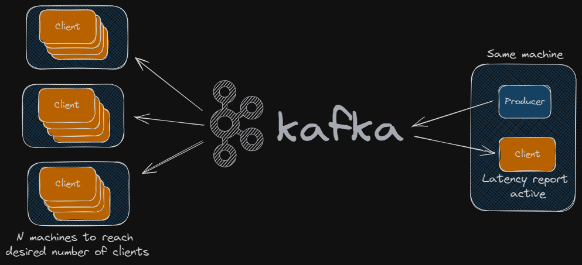

# Lightstreamer vs. Kafka Benchmarking Tool

Welcome to the Lightstreamer Kafka Connector Benchmarking Tool!
This project provides a suite of programs designed to benchmark the performance of Lightstreamer Kafka Connector in handling high-volume data streams across thousands of clients.

Lightstreamer kernel, that is the core of Lightstreamer Kafka Connector, optimizes data delivery to clients through its real-time streaming engine, which efficiently manages and prioritizes data updates. By employing techniques like publish-subscribe, delta delivery, conflation, and smart throttling, Lightstreamer minimizes bandwidth usage while ensuring timely delivery of relevant updates to connected clients. This approach allows Lightstreamer to scale seamlessly to support large numbers of concurrently connected clients, making it ideal for high-throughput real-time applications.

## Introduction
This benchmarking tool is intended to assist developers and system administrators in evaluating the real-time data streaming capabilities of Lightstreamer Kafka Connector. By simulating a large number of client connections and measuring various performance metrics, users can gain insights into the scalability, throughput, and latency characteristics of each platform.

The tool includes components for generating load with random data streams, simulating client connections, and measuring key performance indicators such as message delivery latency, throughput, and system resource utilization.

## Features
* __Scalability Testing__: Simulate thousands of concurrent client connections to assess the scalability of Lightstreamer Kafka Connector.
* __Latency Measurement__: Measure end-to-end message delivery latency under varying load conditions.
* __Throughput Analysis__: Evaluate the maximum throughput achievable by each platform under different scenarios.
* __Resource Monitoring__: Monitor system resource utilization (CPU, memory, network) during benchmarking tests.

## Scenarios of Test
Leveraging the software tools from this project, we conducted a series of tests with various configurations to simulate different scenarios.

In the first scenario, we generated simple messages consisting of a single field with a string value of 1024 bytes.
Each message was accompanied by a basic header containing the creation timestamp and the producer's ID.
These messages were sent to a Kafka topic without specifying a key, resulting in all clients receiving all messages.
Furthermore, there was no possibility of performing delta delivery on the message payload.

The second scenario replicated the message composition of the first but added a key value chosen from a set of 40 possibilities to each message sent to Kafka.
This allowed Lightstreamer clients to take advantage of the publish-subscribe functionality and subscribe to a specific item associated with a single key, receiving only the messages relevant to that key.
In contrast, a generic Kafka client would receive all messages and have to determine which message to process based on the key.
The advantages in terms of network bandwidth savings are evident.

In the third scenario, we serialized JSON messages in Kafka. Here, the message producer would send a sequence of messages with variations relative to only a subset of the fields composing the JSON structure, for each key. This approach leverages the benefits of targeted subscription to a particular key, and additionally, the Lightstreamer server could optimize data delivery by sending only the fields from the JSON structure that have actually changed.

In this particular case, the test load is generated through messages composed of a complex JSON structure with various fields:
```JSON
{
  "id": "random_person_name",
  "firstText": "random_alphanumeric_string(256)",
  "secondText": "random_alphanumeric_string(256)",
  "thirdText": "random_alphanumeric_string(256)",
  "fourthText": "random_alphanumeric_string(256)",
  "firstNumber": "random_integer",
  "secondNumber": "random_integer",
  "thirdNumber": "random_integer",
  "fourthNumber": "random_integer",
  "hobbies": ["random_hobby", "random_hobby", "random_hobby"],
  "timestamp": "current_timestamp"
}
```

With each update related to a specific key, the values change only for these fields:
 - timestamp: Always changes to the exact time the new message is generated.
 - One random field among firstText, secondText, thirdText, fourthText: These are 256-character alphanumeric strings generated randomly.
 - One random field among firstnumber, secondNumber, thirdNumber, fourthNumber: These are random integer values.
 - id: This field corresponds to the key used to send the message to Kafka and is a randomly generated person name. It never changes.
 - hobbies: This field is a list of 3 hobbies randomly selected from a list. It never changes.

Here, a variation of the third scenario exists.
In this variation, the JSON object is not mapped to individual fields within the Lightstreamer item by the Lightstreamer Kafka Connector. Instead, it's mapped as a single string value.
Unfortunately, Lightstreamer's delta delivery mechanism, which transmits only changed fields, cannot be used in this situation.
However, similar optimization benefits can be achieved by leveraging available diff algorithms like `Json patch`. This approach is particularly useful for very complex structures that are difficult to map statically or when the client application needs the entire JSON object for specific reasons.

These scenarios demonstrate how key-based filtering and selective field transmission can enhance the scalability, efficiency, and responsiveness of data distribution in real-time streaming applications.

Few headlines emerged form the tests:

 __Key-based Filtering:__ By including a key value in each message sent to Kafka, Lightstreamer clients can subscribe to specific items associated with particular keys. This allows clients to receive only the messages relevant to their subscribed keys, reducing network bandwidth usage and processing overhead.

 __Efficient Message Processing:__ While a generic Kafka client would receive all messages and need to filter them based on the key, Lightstreamer clients can optimize message processing by subscribing directly to the desired key, resulting in more efficient message handling and reduced latency.

 __JSON Serialization with Key:__ Serializing JSON messages in Kafka with associated keys enables more granular data distribution and processing.

 __Dynamic Data Updates:__ In real-world scenarios where JSON data structures contain numerous fields, transmitting only the changed fields allows for dynamic updates to be efficiently propagated to clients without unnecessary data overhead.

 __Selective Field Transmission:__ In addition, the Lightstreamer client can further optimize bandwidth usage by subscribing to only a subset of the available fields, selecting only those actually required for its operations. This approach results in additional resources savings.


## Test Methodology

#### Pure Kafka Clients Case


#### Lightstreamer Kafka Connector Case


The tests were conducted in an AWS environment using EC2 instances. Specifically, the following instances were dedicated:

- A t2.small instance dedicated to the producer, which simulates various scenarios, and to the client that consumes messages with the 'latency report' function enabled to calculate statistics. Since the message producer, which generates the timestamp, and the client that calculates latency are on the same machine, we did not encounter any clock synchronization issues.
- A c7i.xlarge instance dedicated to the Kafka broker. The installation used is the official Apache Kafka distribution version 3.5.1.
- A c7i.xlarge instance dedicated to the Lightstreamer Kafka Connector.
- N instances of type c7i.2xlarge to simulate clients. For the pure Kafka case, we used the consumers present in this project. For the Lightstreamer Connector case, we used a modified version of the Lightstreamer Load Test Toolkit (https://github.com/Lightstreamer/load-test-toolkit).

The Lightstreamer server version used was 7.4.2 and Lightstreamer Kafka Connector version 0.1.0.
In the folder `resources/ConnectorConfigurations` there are the configurations (the `adapters.xml` file) used for the Lightstreamer Kafka Connector in the varius scenarios. In all the configurations the parameter

```sh
    <!-- The Kafka cluster address -->
    <param name="bootstrap.servers">localhost:9092</param>
```

contains localhost but should be changed with the actual Kafka cluster address.

Below the launch command used for the producer in the various scenario:

- scenario1

- scenario2
```sh
java -cp "dependency/*:dependency/log4j2.xml" com.lightstreamer.MessageGenerator ...:9092 LTest 10 100 1024 keyed
```

- scenario3
```sh
java -cp "dependency/*:dependency/log4j2.xml" com.lightstreamer.MessageGenerator ...:9092 LTest 10 100 1024 complex
```

### Measurements
The consumers reading the messages can be activated with a special flag to enable latency calculation. In this case, the difference between the timestamp in the message (for string messages, the timestamp value is in the first 23 characters, for JSON messages, there is a specific field) and the reception time is calculated for each message. In all tests, the message source and the clients configured for latency calculation, which were only 5 sessions in the tests, are run on the same machine. The real massive traffic will be generated by other instances of the Client Simulator running on different machines, which do not analyze latencies.
These values are passed to an instance of the StatisticsManager class, which collects all the information from all client sessions and processes the statistics.
A report is produced to the console every minute; here is an example:

```sh
Test Duration: 0 Hours 24 minutes and 0 seconds
Number of samples: 6335
Min = 4 ms
Mean = 15 ms - Standard Deviation = 86 ms
Max = 2643 ms
25th Percentile = 7 ms
50th Percentile = 10 ms
75th Percentile = 14 ms
90th Percentile = 18 ms
95th Percentile = 24 ms
98th Percentile = 33 ms
Min
0004 - 0334 ********************|
0334 - 0664
0664 - 0994 |
0994 - 1324 |
1324 - 1654 |
1654 - 1984 |
1984 - 2314 |
2314 - 2644 |
Max

ZOOM
Min
0004 - 0006 *******************|
0006 - 0008 ********************|
0008 - 0010 *******************|
0010 - 0012 ****************|
0012 - 0014 ***********|
0014 - 0016 *******|
0016 - 0018 *****|
0018 - 0020
90th percentile
```

## Results

### __Scenario 1__ 

| N. Clients | 1K | 2K | 4K | 8K | 12K | 14K | 16K | 18K | 20K | 32K | 40K | 50K |
|----------|----------|----------|----------|----------|----------|----------|----------|----------|-----------|----------|-----------|-----------|
| Kafka Clients (N consumer groups) | 6 (17) | 13 (18) | 35 (344) | 53 (45) | 363 (1494) | 1068 (914) | 3376 (507) | x | x | x | x |
| Kafka Clients (standalone) | - | - | - | 74 (84) | - | 111 (59) | 375 (219) | 1202 (979) | 2201 (1944) |  x | x | x |
| Lightstreamer Clients | 10 (17) | 16 (15) | 27 (17) | 33 (21) | - | 52 (21) | 91 (37) | 144 (34) | 128 (147) | 158 (71) | 252 (87) | 787 (226) |
*Mean (Standard Deviation) expressed in millisecond*

### __Scenario 2__ 

| N. Clients | 4K | 6K | 8K | 10K | ... | 52K | 64K | 70K | 80K | 90K |
|----------|----------|----------|----------|----------|----------|----------|----------|----------|----------|----------|
| Kafka Clients (N consumer groups) | 114 (34) | 717 (70) | 1051 (137) | x | ... | x | x | x | x | x |
| Kafka Clients (standalone) | 268 (388) | 513 (625) | 785 (814) | 1426 (4157) | ... | x | x | x | x | x |
| Lightstreamer Clients | 8 (16) | 12 (17) | 16 (8) | 19 (13) | ... | 24 (16) | 28 (26) | 59 (56) | 67 (207) | 1876 (1487) |

*Mean (Standard Deviation) expressed in millisecond*

| N. Clients                        | 4K | 6K | 8K | 10K | ... | 52K | 64K | 70K | 80K | 90K |
|----------|----------|----------|----------|----------|----------|----------|----------|----------|----------|----------|
| Kafka Clients (N consumer groups) | 3.6G | 5.4G | 7.1G | x | ... | x | x | x | x | x | x |
| Kafka Clients (standalone)        | 3.6G | 5.4G | 7.1G | 8.9G | ... | x | x | x | x | x |
| Lightstreamer Clients             | 90M | 133.5M | 179.5M | 223.5M | ... | 1.16G | 1.43G | 1.57G | 1.75G | 2.01G |
*bit/s*
 

### __Scenario 3__ 

| N. Clients                        | 2K | 4K | 6K | 10K | 20K | 40K | 50K | 65K | 75K |
|----------|----------|----------|----------|----------|----------|----------|----------|----------|----------|
| Kafka Clients (N consumer groups) | 25 (103) | 503 (669) | 918 (1068) | x | x | x | x | x | x |
| Kafka Clients (standalone)        | 25 (103) | 298 (362) | 504 (535) | x | x | x | x | x | x |
| Lightstreamer Clients             | 7 (21) | 8 (47) | 8 (27) | 9 (36) | 16 (42) | 27 (49) | 33 (51) | 53 (74) | 139 (214) |
| Lightstreamer (jsonpatch)         | 6 (8) | 8 (63) | 8 (7) | 9 (6) | 19 (12) | 33 (17) | 44 (57) | 91 (75) | 221 (134) |

*Mean (Standard Deviation) expressed in millisecond*

| N. Clients                        | 2K | 4K | 6K | 10K | 20K | 40K | 50K | 65K | 75K |
|----------|----------|----------|----------|----------|----------|----------|----------|----------|----------|
| Kafka Clients (N consumer groups) | 2.3G | 4.7G | 6.9G | x | x | x | x | x | x |
| Kafka Clients (standalone)        | 2.3G | 4.5G | 6.7G | x | x | x | x | x | x |
| Lightstreamer Clients             | 14.5M | 29M | 43M | 72M | 143M | 288M | 355M | 460M | 537G |
| Lightstreamer (jsonpatch)         | 20M | 40M | 60M | 99M | 195M | 394M | 482M | 605M | 655G |
*bit/s*

## Useful links

- Lightstreamer Server download page: [https://lightstreamer.com/download/](https://lightstreamer.com/download/)
- Lightstreamer Kafka Connector: [https://github.com/Lightstreamer/Lightstreamer-kafka-connector](https://github.com/Lightstreamer/Lightstreamer-kafka-connector)
- Apache Kafka: [https://kafka.apache.org/quickstart](https://kafka.apache.org/quickstart)

## Contributing
We welcome contributions from the community! If you encounter any issues, have feature requests, or would like to contribute enhancements to the benchmarking tool, please see the Contribution Guidelines for instructions on how to get involved.